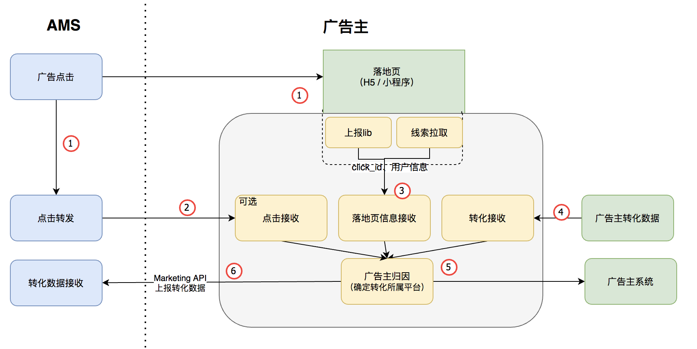

# Attribution

> 帮助广告主实现自归因，只需要简单的配置，就能快速使用。

## Overview



## Get Start

### 简单测试，在根目录执行

```shell
cd attribution
bash logic_test.sh
```

默认执行归因example

### Installation

我们提供docker，helm。推荐使用helm可以在k8s集群一键启动服务，且能自动扩缩容。

#### install from docker image

```shell
docker pull attribution:latest
docker run -d -p 9081:9081 attribution:latest -conv_parser_name=ams -click_parser_name=ams -attribution_result_storage=stdout -server_address=:9081 -v=50 -logtostderr
```

## 功能介绍

### 系统功能

- 点击数据接收
- 落地页数据接收
- 归因逻辑
- 归因后，上报对应平台的转化数据

#### Extra

- 和AMS归因逻辑整体保持一致
- 支持在线server，离线batch两种方式，支持不同的场景


## 归因整体逻辑

整体逻辑为：

- 用户ID体系
- 点击日志索引
- 归因
  - 点击日志匹配
  - 点击日志筛选
  - 点击日志排序


### 用户ID体系

根据AMS点击下发，支持这些[ID体系](https://git.code.oa.com/tssp/attribution/blob/master/internal/data/user_data.go)


### 点击日志索引

根据量级可以选用不同的存储，如hbase、ckv、local memory等，目前方便运行确定逻辑，使用的是local memory


### 归因匹配

根据转化数据，匹配最合适的点击

#### 点击日志匹配

根据点击日志索引，根据appid和用户id，匹配所有的点击日志


#### 点击日志过滤

这里实现了最普遍的策略

- 点击时间 < 转化时间
- 转化时间 - 点击事件 < 7天


#### 点击日志排序

AMS的实现包含了打分逻辑，不过按照开会讨论的结果，只需要按照点击时间排序，所以目前的逻辑是取最新的点击时间